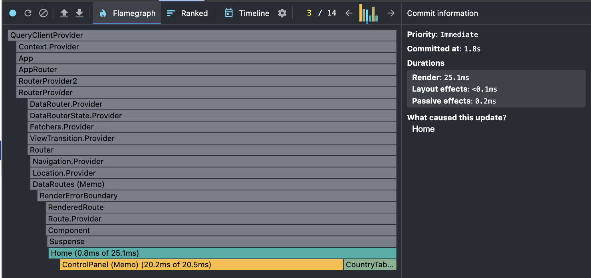

# CO2 Emissions Data App

## Performance Profiling and Project Structure Constraints

**React DevTools Profiler** is used to measure the performance of the app.

According to the component structure of this project, there is only one place where adding memoization is truly useful: preventing the **table** component from re-rendering when opening the column selection modal.

First of all, I have the **Control Panel** compoment where all inputs and buttons to control the table are placed, so clicking on the particular input will call **Control Panel** function because and chnge the appearence of the panel.

But let’s examine the performance for all interactions with the table.

### Before adding memoization

- Sorting the table

- Searching for country name

- Select the other year

- Interaction with the columns selecting modal

### After adding memoization

- Sorting the table

- Searching for country name

- Select the other year

- Interaction with the columns selecting modal

### Summary

As we can see, memoization helps prevent the table component from re-rendering when interacting with the modal component. This works because the modal state does not affect the table’s props or dependencies, so the table is not re-rendered unnecessarily.
